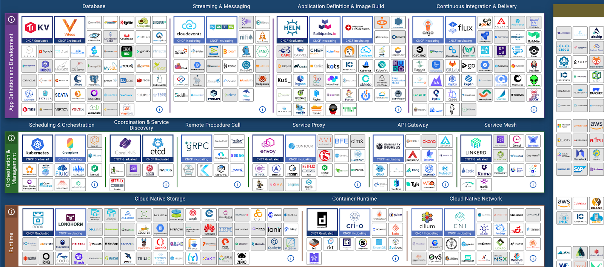

# Delivering more Agile, Resilient and Efficient IT

## What happened after the pandemic

After the pandemic, a new normal sets in. New digital services were delivered quickly during the pandemic. Now we need to focus on stabilizing and slowing down. CEO priority shits to stability instead
of growth.

How do we give the leaders confidence? The things we deliver need to be backed up by stable platforms. How can you be resilient, efficient _and_ agile?!

Let's take a step back and look at when things were less agile. This was when we built monoliths. They were stable, but very difficult to change. To _fix_ that, we moved to smaller services, containers,
all the cool things to make change easier. This is the result..

This landscape is driven by "I'll just build it myself". When you build a tool, it's designed for a specific purpose. You have blind spots.

This talk is brought to you by [LogicMonitor](https://www.logicmonitor.com/), a platform built for eliminating blind spots.

## The goals of observability

- Immediate notifications: no emails, but something direct like Slack or Discord or SMS (hello Mr. Dinosaur)
- Answer questions based on observability data: tie tracing and logs and metrics together

LogicMonitor started as an infrastructure platform, it started off in a datacenter. Then the app stack is build on top of it, traces and logs. Then APM is sprinkled on top. _aaaaargh he starts mentioning AI_
All these things combined lead to AIOps, which leverages all your data to pinpoint problems. _Note to self: it's not AI, it's a bunch of if-statements and timestamps_

## Observability in your team

- Look at what tools you have that take time
- Which tools can we move to a hosted monitoring platform
- Have we considered OpenTelemetry

## Questions

- Why is LogicMonitor not the 15th standard tool?
    - Consolidate all sub-companies and teams and consolidate monitoring tools. _This seems like a naive answer..Why didn't I think of this?_
    - TLDR: Remove silos
- How do you prevent exploding costs?
    - The technical answer: LogicMonitor does rate limiting
    - The other answer: Reduce log rate, ask LM to stop ingesting logs. For once, you can go over your limit without being charged extra.
- What about licensing?
    - It's based on workloads. If you have 100 pods and 10 nodes, you need 110 licenses. _this throws smaller pods and nodes out of the window_
    - Metric data is kept for 2 years, but they don't charge for ingested data
- What is AIOps?
    - It's a combination of anomaly detection in metrics and logs
    - LogicMonitor makes a baseline. Within a week, they've built a picture. When the resource deviates from the baseline, an action can be taken. _THAT'S AN IF-STATEMENT, WHY IS IT CALLED AI_
